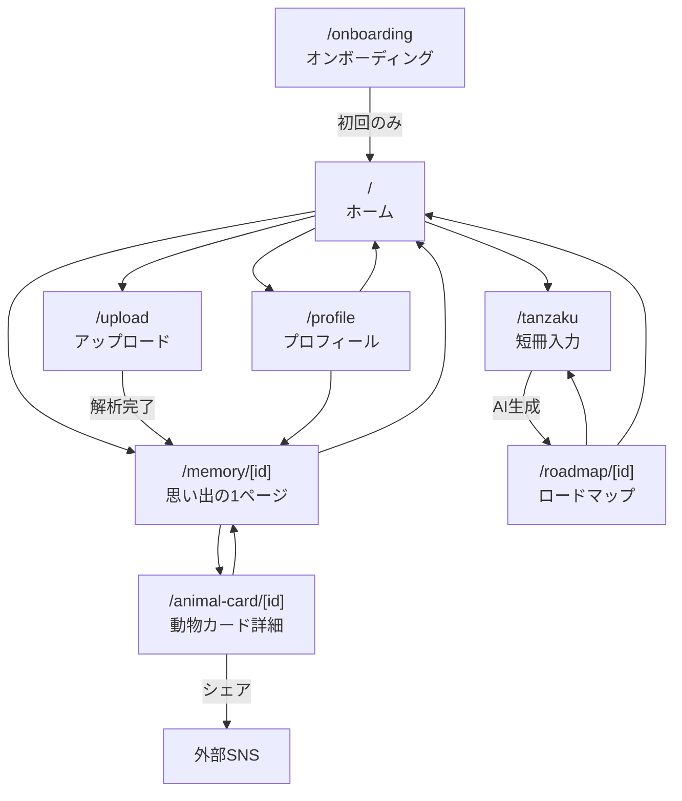

# 画面一覧 & 情報アーキテクチャ

## 画面遷移図



---

## 1. オンボーディング

| 項目 | 内容 |
|------|------|
| ルート | `/onboarding` |
| 目的 | アプリの世界観を伝え、アカウント作成を完了させる |
| 優先度 | 🔴 Must |

### 主要コンポーネント

- スプラッシュスライド（3画面スワイプ）
  - Slide 1: 「写真が、思い出の1ページになる」— MEMORIA紹介
  - Slide 2: 「感情が、動物になる」— 動物キャラクター紹介
  - Slide 3: 「夢が、ロードマップになる」— 短冊ドリームロード紹介
- Google OAuth ログインボタン
- ニックネーム入力フォーム
- アバター初期化アニメーション

### 遷移

- 遷移元: アプリ初回アクセス時
- 遷移先: ホーム（`/`）

---

## 2. ホーム（アバター + ダッシュボード）

| 項目 | 内容 |
|------|------|
| ルート | `/` |
| 目的 | アバターを中心に、各機能へのハブとなるダッシュボード |
| 優先度 | 🔴 Must |

### 主要コンポーネント

- アバター表示エリア（画面上部、感情状態反映）
- 今日の感情ステータス（動物アイコン + ひとこと）
- クイックアクションボタン
  - 「思い出を記録する」→ `/upload`
  - 「夢を書く」→ `/tanzaku`
- 最近の思い出カード（直近3件のサムネイル）
- ボトムナビゲーション（ホーム / アップロード / 短冊 / プロフィール）

### 遷移

- 遷移元: オンボーディング / 各画面からの戻り
- 遷移先: アップロード / 短冊入力 / プロフィール / 日記ビュー

---

## 3. 写真アップロード・解析中

| 項目 | 内容 |
|------|------|
| ルート | `/upload` |
| 目的 | 写真・テキストをアップロードし、AI解析を実行する |
| 優先度 | 🔴 Must |

### 主要コンポーネント

- 写真選択エリア（ドラッグ&ドロップ / ファイル選択）
- テキスト入力フィールド（ひとこと日記、プレースホルダー: 「今日はどんな日だった？」）
- アップロード＆解析ボタン
- 解析中ローディング画面
  - アバターが考えているアニメーション
  - 「感情を読み取っています...」等のステータステキスト
- エラー時のリトライUI

### 遷移

- 遷移元: ホーム
- 遷移先: 思い出の1ページ（`/memory/[id]`）

---

## 4. 思い出の1ページ（日記ビュー）

| 項目 | 内容 |
|------|------|
| ルート | `/memory/[id]` |
| 目的 | AI生成された日記を美しいレイアウトで表示する |
| 優先度 | 🔴 Must |

### 主要コンポーネント

- 日付ヘッダー
- アップロード写真（メインビジュアル）
- AI生成テキスト（日記本文）
- 感情タグ（例: 🐱 自由っぽい / 🐰 ちょっと不安）
- 動物カードへのリンクボタン
- 感情スコア / ムードインジケーター
- 戻るボタン / ホームへ戻る

### 遷移

- 遷移元: アップロード（解析完了後） / ホーム（履歴から）
- 遷移先: 動物カード詳細 / ホーム

---

## 5. 動物カード詳細（MBTI風共有ページ）

| 項目 | 内容 |
|------|------|
| ルート | `/animal-card/[id]` |
| 目的 | 感情を動物キャラクターとしてMBTI診断風に表示し、共有を促す |
| 優先度 | 🔴 Must |

### 主要コンポーネント

- 動物キャラクターイラスト（大きめ表示）
- 動物名 & キャッチコピー（例: 「気まぐれネコ — 自由を愛する冒険家」）
- 性格特性カード（4〜5項目、レーダーチャートまたはバー表示）
  - 例: 好奇心 ★★★★☆ / 社交性 ★★☆☆☆ / 冒険心 ★★★★★
- 感情の解説テキスト（2〜3文）
- SNSシェアボタン（画像として書き出し → シェア）
- 戻るボタン

### 動物キャラクター定義

| 感情状態 | 動物 | キャッチコピー |
|----------|------|---------------|
| 自由っぽい・マイペース | 🐱 ネコ | 気まぐれに世界を歩く |
| 寂しい・不安 | 🐰 ウサギ | そっと寄り添う、繊細な心 |
| 元気・活発 | 🦁 ライオン | 太陽のように輝く情熱 |
| 穏やか・安定 | 🐻 クマ | どっしり構えた安心感 |
| 好奇心旺盛 | 🦊 キツネ | 知りたがりの探究者 |

### 遷移

- 遷移元: 思い出の1ページ
- 遷移先: 思い出の1ページ（戻る） / 外部SNS（シェア）

---

## 6. 短冊入力

| 項目 | 内容 |
|------|------|
| ルート | `/tanzaku` |
| 目的 | 夢・目標を短冊UIで入力し、AIロードマップ生成をリクエストする |
| 優先度 | 🔴 Must |

### 主要コンポーネント

- 短冊ビジュアル（縦長カード、和紙テクスチャ風背景）
- 夢・目標入力フィールド（例: 「Webデザイナーになりたい」）
- 期限設定（任意）
- 「ロードマップを作る」ボタン
- 過去の短冊一覧（サイドスクロールまたは縦リスト）
- 生成中ローディング

### 遷移

- 遷移元: ホーム
- 遷移先: ロードマップビュー（`/roadmap/[id]`）

---

## 7. ロードマップビュー

| 項目 | 内容 |
|------|------|
| ルート | `/roadmap/[id]` |
| 目的 | AIが生成した夢への具体的ステップを視覚的に表示する |
| 優先度 | 🔴 Must |

### 主要コンポーネント

- 夢タイトル（短冊の内容）
- ステップリスト（タイムライン形式、縦並び）
  - 各ステップ: アイコン + タイトル + 説明文 + チェックボックス
  - 完了/未完了の視覚的区別
- 進捗バー（全体の達成率）
- 「短冊に戻る」ボタン
- 「ホームに戻る」ボタン

### 遷移

- 遷移元: 短冊入力（AI生成完了後）
- 遷移先: 短冊入力 / ホーム

---

## 8. プロフィール

| 項目 | 内容 |
|------|------|
| ルート | `/profile` |
| 目的 | ユーザー情報の確認・編集とアプリ設定 |
| 優先度 | 🔴 Must |

### 主要コンポーネント

- アバター表示（大サイズ）
- ニックネーム表示 / 編集ボタン
- 思い出ポートフォリオ（日記サムネイル一覧 — 🟡 Should）
- 感情統計サマリー（動物キャラクター出現比率 — 🔵 Could）
- 設定メニュー
  - 通知設定
  - アカウント情報
- ログアウトボタン

### 遷移

- 遷移元: ホーム（ボトムナビ）
- 遷移先: ホーム / 日記ビュー（ポートフォリオから）

---

## Next.js App Router ディレクトリ構成

```
app/
├── layout.tsx              # 共通レイアウト（ボトムナビ含む）
├── page.tsx                # ホーム（/）
├── onboarding/
│   └── page.tsx            # オンボーディング
├── upload/
│   └── page.tsx            # アップロード・解析中
├── memory/
│   └── [id]/
│       └── page.tsx        # 思い出の1ページ
├── animal-card/
│   └── [id]/
│       └── page.tsx        # 動物カード詳細
├── tanzaku/
│   └── page.tsx            # 短冊入力
├── roadmap/
│   └── [id]/
│       └── page.tsx        # ロードマップビュー
└── profile/
    └── page.tsx            # プロフィール
```

---

## 共通コンポーネント

| コンポーネント | 用途 | 使用画面 |
|----------------|------|----------|
| `BottomNav` | ボトムナビゲーション | 全画面（オンボーディング除く） |
| `Avatar` | アバター表示 | ホーム / プロフィール |
| `AnimalIcon` | 動物キャラクターアイコン | 日記ビュー / カード詳細 / ホーム |
| `GlassCard` | Glassmorphism カード | 全画面で汎用利用 |
| `LoadingScreen` | ローディング画面 | アップロード / 短冊 |
| `PageHeader` | ページヘッダー（戻るボタン付き） | サブ画面全般 |
